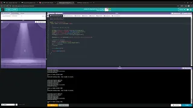

# Unit 4 - Abstract Art Project

## Introduction

Data visualizations are powerful tools to present information and convey patterns and relationships. Sometimes visualizations are charts or graphs, and other times they are more abstract pieces of art. Your goal is to create a visual representation relating at least two categories from your dataset that engages your viewer and encourages them to learn more about your chosen topic.

## Requirements

Use your knowledge of object-oriented programming, one-dimensional (1D) arrays, and algorithms to create your data visualization program:

- **Create at least two 1D arrays** – Create at least two 1D arrays to store the data that will make up your visualization.
- **Implement one or more algorithms** – Implement one or more algorithms that use two-way or multi-selection statements with compound Boolean expressions to analyze the data.
- **Use methods in the Math class** – Use one or more methods in the Math class in your program, such as to perform calculations on the values in your dataset and display the results, choose random values from the dataset, or display images or shapes at random locations.
- **Create a visualization** – Create an image or animation that conveys the story of the data by illustrating the patterns or relationships in the data.
  Note: This may be abstract! Others do not necessarily need to know what the story or pattern is right away, but you do need to be able to explain it to them.
- **Document your code** – Use comments to explain the purpose of the methods and code segments and note any preconditions and postconditions.

## Dataset

Include a hyperlink to the source of your dataset used for this project. Additionally, provide a short description of each column used from the dataset, and the data type.

Dataset: https://docs.google.com/spreadsheets/d/1p1FGWRnUf3bFhWrtWO9ovsfN80TbiBFUcCH0E1i5TNo/edit?usp=sharing

- **Year** (int) - Year each album came out
- **Album** (String) - Name of each album
- **Artist** (String) - Artist of each album
- **Genre** (String) - Genre(s) of each album

## UML Diagram

Put and image of your UML Diagram here. Upload the image of your UML Diagram to your repository, then use the Markdown syntax to insert your image here. Make sure your image file name is one work, otherwise it might not properly get display on this README.

 UML Diagram.png>)

## Video Demo

Record a short video of your abstract art animation to display here on your README. You can do this by:

- Screen record your project running on Code.org.
- Upload that recording to YouTube.
- Take a thumbnail for your image.
- Upload the thumbnail image to your repo.
- Use the following markdown

https://youtu.be/1mkh2avN4BU

## Description

Write a description of your project here. In your description, include as many vocab words from our class to explain your User Story, the chosen dataset and how your project addressed that users goals. If your project used the Scanner class for user input, explain how the user will interact with your project.

My project uses data from the top 500 albums of all time. This data set uses album names, years, artists, and genres. It first uses multi-selection statements and for-loops to get the information on a specific album, chosen by the user using a Scanner. It will then use the genres especially. It firsts gets a String of genres and separates each genre into an index in a 1D array using the substring method. It will then correspond each genre to an image, chosen using nested for-loops, that will be shown on screen. On screen, the title, year, artist, and genres are printed along with randomly placed images; the positions were generated using the Math.random() method.